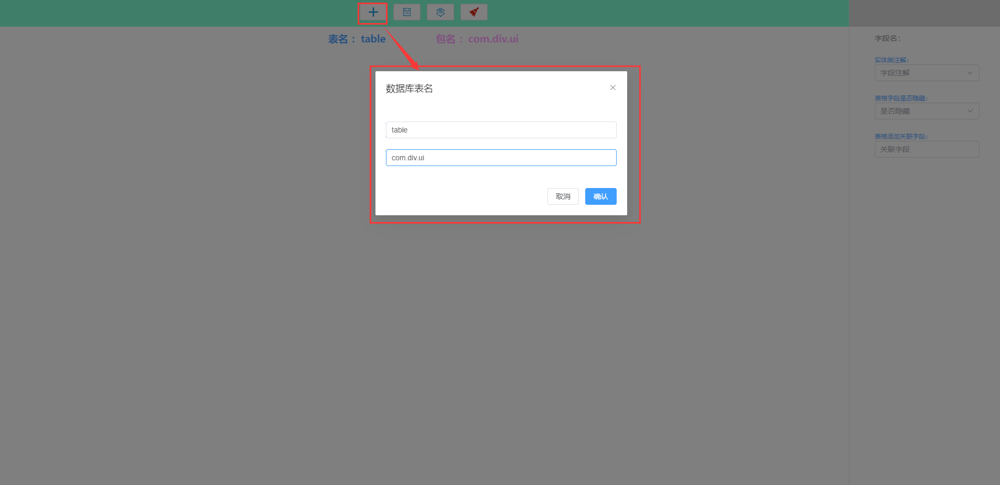
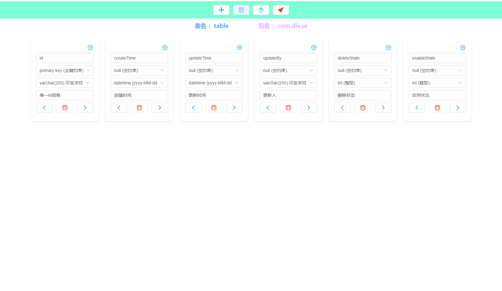
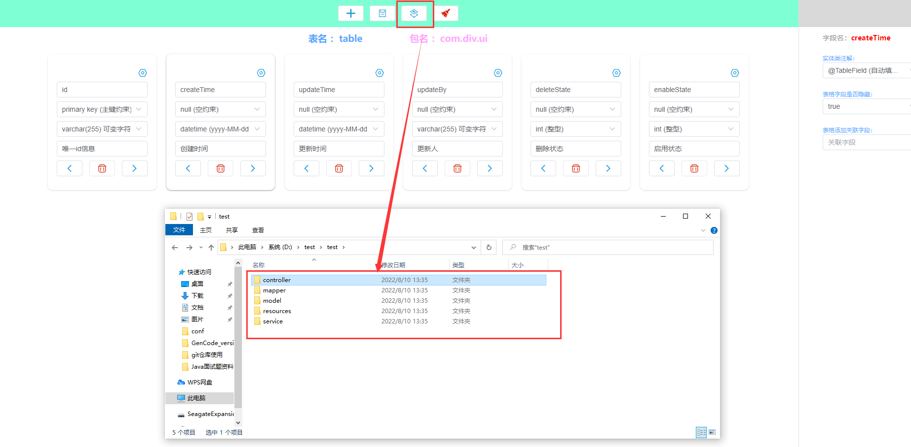

# 自动生成文件


### 说明:

#### 可以自动生成后端代码CRUD基本接口

### 

### 可通多界面设置字段，生成对应的后端代码


### 

------


### 1. 第一步，拉取代码, 配置好项目中的maven路径，和web模块

### 找到项目中的资源文件

#### resources/generate/pro.properties 

### path是配置生成文件的路径


### 2. 第二部启动项目

```properties
如果要更换端口的话
请找到application.properties中的
server.port=10002

更换完之后请找到webapp下的index.js中的240行

内容为：
$.post('http://localhost:10002/GenCodeController/genCode', {
	table : JSON.stringify(this.table)
})

对应的端口号也需要更换
```


### 启动项目后通过浏览器访问：http://localhost:10002/


### 3.创建字段




### 4.创建之后默认字段内容

```properties
如果不需要默认字段则找到webapp文件下的index.js中163行中的的filed数组对象，可以选择不想要的字段进行删除，重新创建。
```




### 5.生成文件看看




### 最后将代码进行复制到自己的项目中，接口测试


### 前提：后端代码基于需要引入mybatis-plus和mybatis-plus配置项

```xml
<dependency>
    <groupId>com.baomidou</groupId>
    <artifactId>mybatis-plus-boot-starter</artifactId>
    <version>3.5.0</version>
</dependency>
```


### 数据自动填充配置项

```java
@Slf4j
@Component //需要加入到ioc容器中
@Configuration
public class MyMetaObjectHandler implements MetaObjectHandler {

    /**
     * 删除操作
     * @param metaObject
     */
    @Override
    public void insertFill(MetaObject metaObject) {
        log.info(" start insert fill ...");
        this.setFieldValByName("createTime", new Date(), metaObject);//创建时间
        this.setFieldValByName("updateTime", new Date(), metaObject);//更新时间
        this.setFieldValByName("deleteState", 0, metaObject);//删除状态
        this.setFieldValByName("enableState", 0, metaObject);//启用状态
    }


    /**
     * 更新操作
     * @param metaObject
     */
    @Override
    public void updateFill(MetaObject metaObject) {
        log.info(" start update fill ...");
        this.setFieldValByName("updateTime", new Date(), metaObject);//更新时间
        this.setFieldValByName("updateBy", "李白", metaObject);//更新人
    }
}
```


### 实现分页配置项

```java
package divui.ai.view.server.conf;

import com.baomidou.mybatisplus.extension.plugins.MybatisPlusInterceptor;
import com.baomidou.mybatisplus.extension.plugins.inner.OptimisticLockerInnerInterceptor;
import com.baomidou.mybatisplus.extension.plugins.inner.PaginationInnerInterceptor;
import org.springframework.context.annotation.Bean;
import org.springframework.context.annotation.Configuration;
import org.springframework.transaction.annotation.EnableTransactionManagement;

/**
 * @author pwx
 * @version 1.0
 * @createDate: 2022年07月27
 * @comment
 */
@EnableTransactionManagement
@Configuration
public class MyBatisPlusConf {


    @Bean
    public MybatisPlusInterceptor mybatisPlusInterceptor() {
        MybatisPlusInterceptor interceptor = new MybatisPlusInterceptor();
        //配置分页
        PaginationInnerInterceptor page = new PaginationInnerInterceptor();
        interceptor.addInnerInterceptor(page);
        interceptor.addInnerInterceptor(new OptimisticLockerInnerInterceptor());
        return interceptor;
    }


}
```

